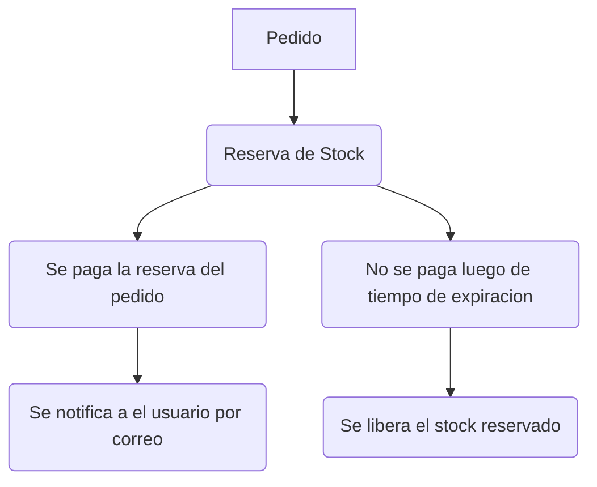

Decisiones Técnicas

# 1. Contexto

El flujo considerado es:

# 2. Supuestos

## 2.1. Modelo de inventario

Se consideran tres cantidades:

- stock: unidades disponibles para nuevas reservas.
- reserved: unidades actualmente reservadas y pendientes de pago.
- confirmed: unidades cuya compra fue confirmada.

Ejemplo:

Inventario inicial:
stock = 10 reserved = 0 confirmed = 0

Después de reservar 3 unidades:
stock = 7 reserved = 3 confirmed = 0

Después de confirmar:
stock = 7 reserved = 0 confirmed = 3

Las unidades confirmadas no vuelven a estar disponibles.

## 2.2. Sku y Order Id unico

Se asume que orderId identifica de forma única una solicitud de reserva.

Si llegar una operacion nueva con los mismos datos se contempla como una nueva reserva.

Si el mismo orderId llega posteriormente con un SKU o cantidad diferente.

## 2.3. Categorías

Se aplican las siguientes reglas:

| Categoría  | 	Expiración | 	Límite por pedido |             
|------------|------------|-------------------|
| STANDARD   | 	15 minutos | 	Sin límite        |
| PRE_ORDER  | 	24 horas	   | Sin límite        |
| FLASH_SALE | 5 minutos	  | 2 unidades        |

La lógica de las categorías se mantiene separada de la lógica general de reservas para facilitar futuras modificaciones.

## 2.4. Expiración

Al momento de crear una reserva se crea con una fecha de expiracion segun su categoria luego de expirada la reserva el stock reservado pasa a ser disponible

## 2.5. Confirmación

Una reserva solamente puede confirmarse mientras esté activa.

## 2.6. Stock bajo

Se considera que existe stock bajo cuando stock <= 5 y se enviara un correo esto esta pendiente de desarrollo

## 2.7. CategoryConfiguration y ProductConfiguration

Se crearon esas dos clases de apoyo para permitir que las reglas de negocio sean configurables y no acotadas a un escenario especifico

# 3. Lo que se dejó fuera  importante para salir a produccion

## 3.1. Base de datos

No se implementó persistencia en ningun tipo de base de datos y todo se implemento en memoria considerando el uso de mapas como una salida rapida 

## 3.2. Servicio real de notificaciones

No se implementó el envío real de emails, el mecanismo de alertas utiliza StockAlertListener como punto de integración.

## 3.3. Arquitectura distribuida

No se implemento sincronizacion o anotacion @Syncrhonized debido a que la expiración se procesa bajo demanda durante las operaciones del servicio.

Tambien se podria implementar un esquema de colas con mensajes con retraso para procesar cada reserva segun su vencimiento y no estar buscando entre todas las reservas

## 3.4 Producto por reserva

Se recomienda usar una estrategia para manejar mas de un producto por reserva

## 3.5 Documentacion

Generar documentacion con swagger y mermaid

## 3.6 Pruebas

Se debe de tener un reporte de cobertura de pruebas con jacoco para medir la cobertura de las pruebas funcionales
